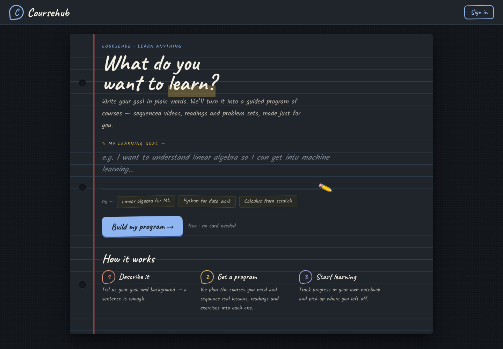
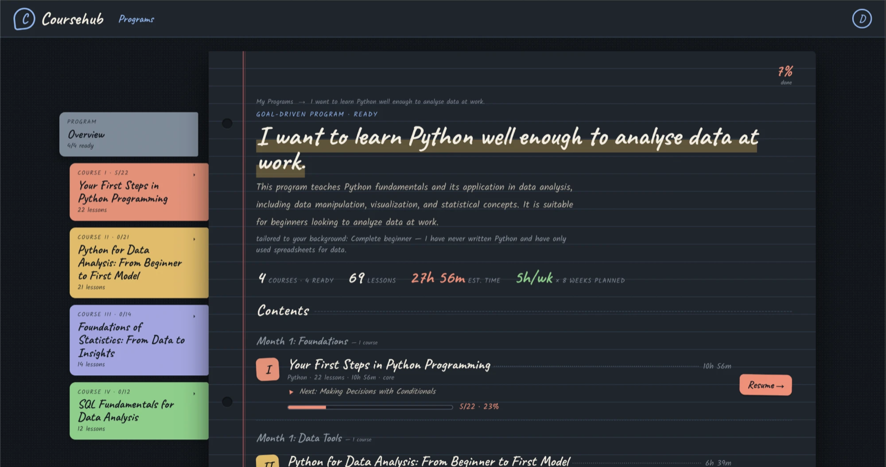
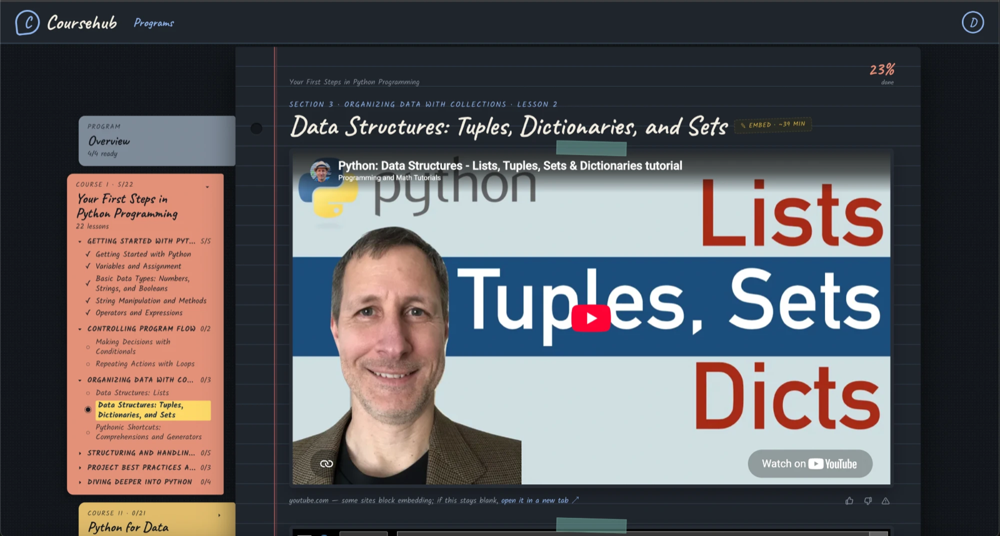
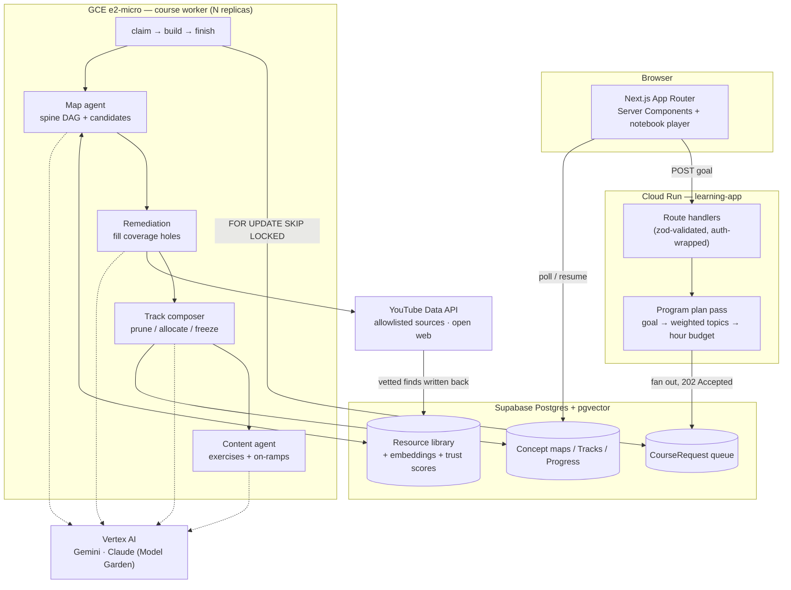
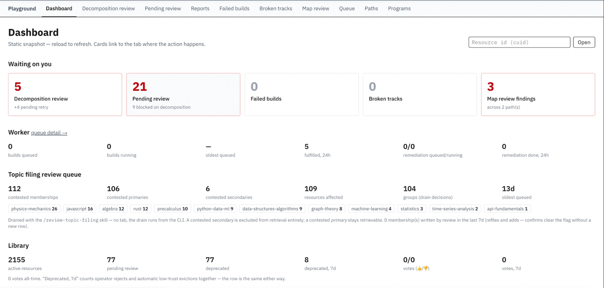

# Coursehub — an AI curriculum engine

**Describe a learning goal in one sentence. Get back a sequenced, multi-course program built out of vetted free material on the open web — then learn it, track progress, and rate what you're given.**

🔗 **Live:** <https://learning-app-sau6bxtxta-uw.a.run.app> · Google sign-in, free, no card

<p align="center">
  
</p>

<div align="center">

`TypeScript` · `Next.js 16` · `React 19` · `PostgreSQL + pgvector` · `Prisma` · `Google Vertex AI` · `Cloud Run` · `Docker` · `Tailwind`

</div>

---

## 1. What it's trying to do

The free material to learn almost anything already exists — MIT OpenCourseWare, 3Blue1Brown, official docs, university problem sets. The problem was never supply. It's that **nobody sequences it for you**. A search gives you a hundred disconnected tabs with no answer to "what do I need first, and what can I skip?"

Course aggregators don't solve this either: they list courses, one topic at a time. But a real goal — *"I want to understand linear algebra so I can get into machine learning"* — isn't one topic. It's four, in a particular order, with a particular budget.

Coursehub closes that gap:

| | |
|---|---|
| **1. Describe it** | Free text, or a chat with an intake agent. *"I know Python but no math. 5 hrs/week, 12 weeks."* |
| **2. It gets planned** | An agent decomposes the goal into ordered topics, weights them by importance, and allocates the hour budget across them. |
| **3. It gets built** | For each topic, a worker fleet builds a concept map, sources real resources against every concept, and composes a lesson-by-lesson course that fits the budget. |
| **4. You learn it** | A notebook-styled player: embedded videos and readings, generated exercises, persisted progress, and thumbs up/down that feed back into what future learners are shown. |

Everything a learner sees is a **real third-party resource** — the AI does the curation, sequencing and pedagogy, not the teaching. Programs across all four launch topics have been built end to end from 100% curated (allowlisted) sources.

### What that produces

One sentence in — *"I want to learn Python well enough to analyse data at work"* — and the engine returns **four sequenced courses, 69 lessons, ~28 hours of material**, fitted to a stated 5 hrs/week over 8 weeks and phased so nothing arrives before its prerequisites.

<p align="center">
  
</p>

Inside a course, the resource is embedded in place with progress tracked per lesson. The thumbs and report controls under each resource aren't decoration — they feed the trust score that decides what future learners get shown.

<p align="center">
  
</p>

---

## 2. Architecture

The interesting part of this project isn't the UI — it's that **course generation is a long-running, expensive, failure-prone pipeline that had to be made reliable**. A build fans out into 4–6 topic jobs, each of which makes dozens of LLM and web calls and takes minutes. It cannot live in an HTTP request.



### The systems behind that diagram

**A durable job queue, safe at N workers.** Requests are enqueued inside the fan-out's transaction and claimed with a single atomic `UPDATE … WHERE id = (SELECT … FOR UPDATE SKIP LOCKED LIMIT 1)`, so two workers never take the same row and neither blocks on the other. Around that: bounded attempts with exponential backoff, stale-claim reclamation, per-job deadlines with `AbortSignal` threaded all the way down to individual model calls, and SIGTERM handling that *requeues* in-flight work rather than failing it. Same-topic contention is resolved one layer down by a Postgres advisory lock plus a partial unique index enforcing single-flight remediation — a worker that loses that race backs off instead of duplicating a build.

**A template/instance split in the data model.** A `Path` is an agent-owned **concept map for an entire topic** — a cycle-validated prerequisite DAG with a required *spine* and an optional *frontier*, plus scored candidate resources per concept. A `Track` is one learner's **immutable traversal** of that map: prune what they already know, trim to their hour budget, pick primaries, freeze alternates, snapshot. One map serves many learners, and a map improving later never mutates a course someone is halfway through.

**A resource library that compounds.** Every vetted find is written back to a shared `Resource` table with pgvector embeddings, a topic filing with provenance, and a `trustScore` — a source-reputation prior moved by precision-weighted evidence (calibrated YouTube engagement signals, learner votes, report triage). Discovery is a **sourcing ladder**: allowlisted high-reputation sources first, open web only on exhaustion. Trust orders candidates; coverage gates them. Low-trust resources are evicted automatically; broken ones are caught by dead-link verification and a user-facing report pipeline.

**An agent architecture, reused seven times.** Every agent in the codebase follows one template: an autonomous **tool-calling retrieval loop** gathers a fixed candidate set, then hands it to a deterministic **select → critic → revise** pipeline judged against an explicit rubric. Retrieval uses hybrid search (structured filters first, vector rank within) and opaque session-scoped handles so the model can't hallucinate resource IDs. Agents resolve their model through a cross-provider registry, so any stage can be pointed at Gemini 2.5/3.x or Claude via a single env var, with no code change.

**Deployment that isn't a toy.** The app is containerized (`output: 'standalone'`) and deploys automatically on merge to `main` via a Cloud Build trigger that runs Prisma migrations before cutting traffic; secrets come from Secret Manager, never the image. The worker runs on a separate Container-Optimized OS VM on its own deploy cadence. Logs are one structured JSON object per line, mapped to Cloud Logging severities and wired to Error Reporting alerts, with LLM token usage recorded per stage so a cost regression is visible rather than inferred.

**Cost and abuse controls, because the expensive path is public.** Per-user quotas on program creation, intake turns, ratings and reports; escalation cool-downs so a pathological topic can't re-run the expensive sourcing ladder on every request; container-only resources that can never be served as a lesson; and a goal gate that rejects out-of-domain requests before any model is called.

<details>
<summary><b>Operator console</b> — the internal surfaces that keep the library healthy</summary>

<br>

Autonomous curation needs a human escape hatch. `/playground` is an admin-gated console for exactly that: a worker-queue view, failed-build triage, a pending-resource review queue with cascading approve/reject, concept-map review and manual editing, broken-track triage, a resource-report triage inbox, and per-agent execution traces with token accounting.

<p align="center">
  
</p>

The library behind it currently holds **2,155 active resources**, each filed to a topic with provenance, embedded for semantic search, and carrying a trust score that moves as evidence arrives.

</details>

---

## 3. Skills and technologies

| Area | What's here |
|---|---|
| **Language** | TypeScript end to end, `strict` mode, no `any` and no escape-hatch casts — types derive from zod schemas via `z.infer` rather than being hand-duplicated |
| **Frontend** | Next.js 16 App Router, React 19 Server Components by default with client components pushed to the leaves, Tailwind v4 with a design-token system and dark mode |
| **Backend** | Thin route handlers (auth → parse → call → respond) over a testable service/agent layer; every route input and every LLM structured output parsed at the boundary |
| **Database** | PostgreSQL on Supabase, 29 models and 42 migrations via Prisma 7, pgvector for semantic search, hand-written raw SQL where Prisma can't express it (partial unique indexes, `SKIP LOCKED` claims, vector operators) |
| **AI / LLM** | Google Vertex AI (Gemini) and Claude via Vertex Model Garden through one registry; tool-calling agents, structured output with schema validation, embeddings, rubric-based critics, prompt-level constraints, per-stage token accounting |
| **Distributed systems** | Durable Postgres-backed queue, multi-replica workers, advisory locks and single-flight indexes, retry/backoff, stale-claim reclamation, job deadlines, graceful shutdown, cooperative cancellation |
| **Cloud / DevOps** | Google Cloud Run, Cloud Build CI/CD with migrations in the deploy pipeline, GCE + Container-Optimized OS, Artifact Registry, Secret Manager, Cloud Logging + Error Reporting; Docker and docker-compose for local multi-worker runs |
| **Auth** | Supabase Auth with Google OAuth, SSR session handling, role-gated admin surfaces, redirect allowlisting |
| **Testing** | Vitest with a split unit/integration project — 100+ test files, pure logic tested without a DB, DB-backed suites gated so a checkout with no secrets still passes |
| **Practice** | 770 commits across 334 merged PRs, migrations-as-code, structured logging, decisions and reversals recorded in [`docs/`](docs/) rather than lost |

Scale, for reference: **~48,000 lines** of TypeScript across **349 files**.

---

## 4. Repo map

```
src/
  app/               Next.js App Router — learner UI, API routes, admin playground
  lib/
    agents/          the AI layer
      program/         goal → weighted topics → hour budget (plan pass)
      intake/          conversational goal-gathering agent
      map/             concept-map authoring: spine DAG, frontier, candidate judging
      track/           per-learner composition: prune, allocate, validate, freeze
      content/         generated exercises, question banks, on-ramp lessons
      decomposition/   splitting playlists/course sites into atomic resources
      tools/           search, web fallback, topic classification
    curation/        trust scoring, review queues, eviction, dead-link + report triage
    services/        queue, worker pipeline, programs, quotas
    ai/              Vertex clients, model registry, embeddings
prisma/              schema + migrations
scripts/             operator tooling, backfills, verification harnesses
docs/                runbooks, roadmap, architecture decision records
```

## 5. Running it locally

```bash
npm install
cp .env.example .env.local   # Vertex AI project, Supabase, database URLs
npx prisma migrate dev
npm run dev
```

```bash
npm run verify   # lint + typecheck + unit tests
```

`npm test` is unit-only and needs no secrets. Deployment runbooks and the full phase-by-phase build history are in [`docs/`](docs/README.md).
